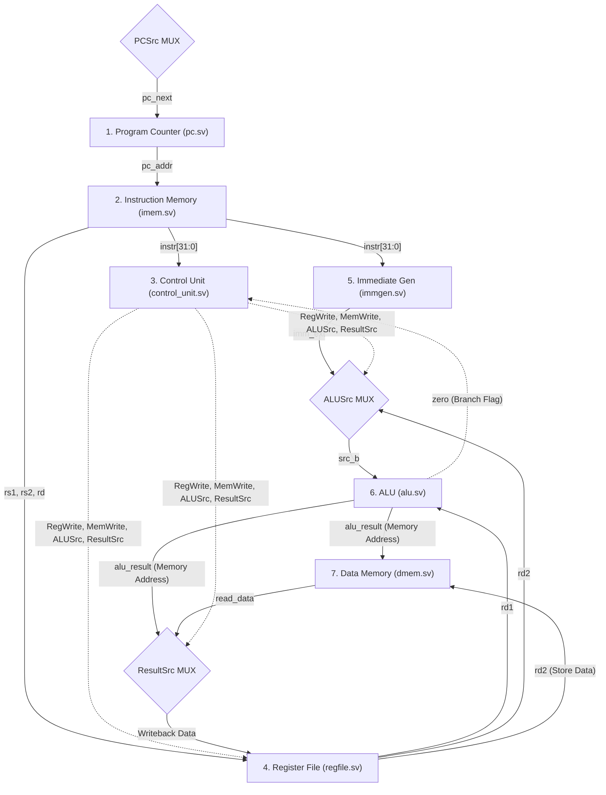

# RISC-V RV32I Single-Cycle Core

A complete, formally structured, and industry-standard 32-bit RISC-V Processor (RV32I Base Integer Instruction Set) designed in SystemVerilog. 

This repository was designed with a strict emphasis on structural modularity, separating execution logic (Adders/Muxes) from state storage (Flip-Flops). It is primarily intended for educational purposes, RTL design analysis, and as a foundation for Design Verification (DV) environments.

## Features
- **Pure SystemVerilog RTL:** Utilizes `always_comb` and `always_ff` specifically to avoid the Verilog inferenced-latch trap.
- **Strict Adherence to RISC-V Specifications:** Supports U, I, R, S, B, and J type instructions. Hardware specifically protects `x0` from write operations and guarantees a strict reset state.
- **Modular Datapath:** Completely isolates the Control Unit out of the datapath, with MUX decisions (`ALUSrc`, `ResultSrc`, `PCSrc`) dictating datapath flow to accurately model physical VLSI synthesis pathways.
- **Sim-Ready Verification Wrapper:** Includes a Top-Level testbench (`tb_riscv_core.sv`) and an automatic `firmware.hex` bootloader pre-configured for rigorous instruction testing.

## Block Diagram & Architecture Specification

Below is the definitive structural map of this processor. The Multiplexers (MUXes) actively govern the data flow based on signals generated by the Control Unit (`control_unit.sv`).



## Repository Structure
```text
├── rtl/
│   ├── alu.sv             # Arithmetic Logic Unit
│   ├── control_unit.sv    # Main Decoder & ALU Decoder
│   ├── dmem.sv            # Data Memory (RAM)
│   ├── imem.sv            # Instruction Memory (ROM)
│   ├── immgen.sv          # Immediate Extractor & Sign-Extender
│   ├── pc.sv              # Program Counter Register
│   ├── regfile.sv         # 32x32-bit General Purpose Register Array
│   ├── riscv_core.sv      # Top-Level Structural Wrapper & Datapath Adders
│   ├── tb_riscv_core.sv   # Functional Verification Testbench
│   └── firmware.hex       # Comprehensive hex binary compiled for testing U, I, R, S, B, and J formats.
└── README.md
```

## Getting Started / Simulation
1. Create a new RTL Project in **Xilinx Vivado**, **Modelsim/Questa**, or your preferred IDE.
2. Add all `*.sv` files from the `rtl/` directory to the Design Sources.
3. Keep `tb_riscv_core.sv` and `firmware.hex` inside your Simulation Sources. Ensure `firmware.hex` is accessible in the working directory during simulation.
4. Run Behavioral Simulation. 
5. The `tb_riscv_core` monitor will immediately print the `PC` and `Instruction` tracing out to your TCL console/terminal for the first 1000ns.

## Test Firmware
The included `firmware.hex` file executes a comprehensive test designed to hit every core instruction format:
1. `LUI` (U-Type format generation)
2. `ADDI` (I-Type addition)
3. `ADD` (R-Type arithmetic)
4. `SW` (S-Type Data RAM Write)
5. `LW` (I-Type Data RAM Read)
6. `BEQ` (B-Type Conditional Branching based on loaded memory equality)
7. `JAL` (J-Type Unconditional Jumps)
